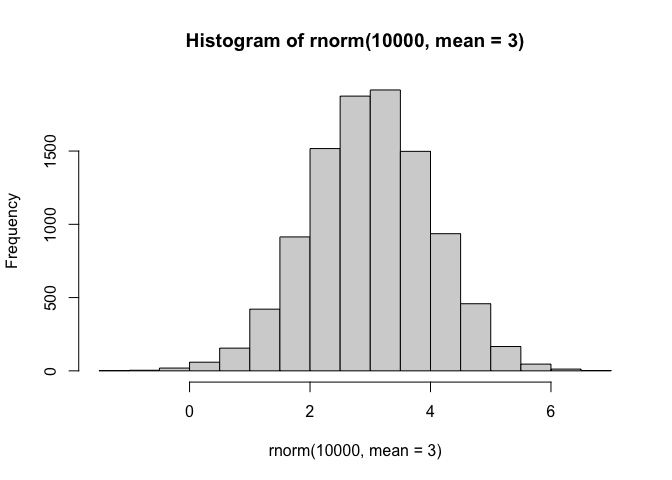

# Class07: Machine Learning 1
Kate Zhou

- [Clustering](#clustering)
  - [K-means](#k-means)
  - [Hierarchical Clustering](#hierarchical-clustering)
- [Dimensionality reduction, visualization and ‘structure’
  analysis](#dimensionality-reduction-visualization-and-structure-analysis)
  - [Principal Component Analysis
    (PCA)](#principal-component-analysis-pca)
  - [PCA to the rescue](#pca-to-the-rescue)

Today we will explore universal unsupervised machine learning method
starting with clustering and dimensionality reduction.

## Clustering

To start lets’ make up some data to cluster where we know what the
answer should be. The `rnorm()` function will help us there.

``` r
hist(rnorm(10000, mean=3))
```



Return 30 numbers centered on -3 and

``` r
tmp <- c(rnorm(30, mean=-3), rnorm(30, mean=3))
x <- cbind(x=tmp, y=rev(tmp))

x
```

                   x          y
     [1,] -3.4069473  3.5854195
     [2,] -1.3820130  4.4246468
     [3,] -1.5541738  1.7033855
     [4,] -2.6192476  1.6260522
     [5,] -0.9976397  1.7875426
     [6,] -2.2778296  3.0790177
     [7,] -2.1340989  3.3002423
     [8,] -1.8299728  3.5955459
     [9,] -3.3397787  2.8100921
    [10,] -2.9644326  5.3297136
    [11,] -2.4168748  3.3079540
    [12,] -3.4427407  1.7760204
    [13,] -3.2017866  2.6039556
    [14,] -3.0466589  3.0231687
    [15,] -2.4289273  0.0380217
    [16,] -2.2723499  3.3087399
    [17,] -2.8855790  4.1599424
    [18,] -0.8062506  3.6807987
    [19,] -3.0658728  2.6241540
    [20,] -4.5643456  2.1637482
    [21,] -1.1516300  3.9961542
    [22,] -3.5988030  3.4187214
    [23,] -2.6385573  3.9487393
    [24,] -4.0001917  3.3990131
    [25,] -4.5091099  2.8884604
    [26,] -1.6717155  3.9156123
    [27,] -5.7818453  4.0624860
    [28,] -1.5998682  3.2447308
    [29,] -2.0364399  1.7848033
    [30,] -3.9547305  3.5538787
    [31,]  3.5538787 -3.9547305
    [32,]  1.7848033 -2.0364399
    [33,]  3.2447308 -1.5998682
    [34,]  4.0624860 -5.7818453
    [35,]  3.9156123 -1.6717155
    [36,]  2.8884604 -4.5091099
    [37,]  3.3990131 -4.0001917
    [38,]  3.9487393 -2.6385573
    [39,]  3.4187214 -3.5988030
    [40,]  3.9961542 -1.1516300
    [41,]  2.1637482 -4.5643456
    [42,]  2.6241540 -3.0658728
    [43,]  3.6807987 -0.8062506
    [44,]  4.1599424 -2.8855790
    [45,]  3.3087399 -2.2723499
    [46,]  0.0380217 -2.4289273
    [47,]  3.0231687 -3.0466589
    [48,]  2.6039556 -3.2017866
    [49,]  1.7760204 -3.4427407
    [50,]  3.3079540 -2.4168748
    [51,]  5.3297136 -2.9644326
    [52,]  2.8100921 -3.3397787
    [53,]  3.5955459 -1.8299728
    [54,]  3.3002423 -2.1340989
    [55,]  3.0790177 -2.2778296
    [56,]  1.7875426 -0.9976397
    [57,]  1.6260522 -2.6192476
    [58,]  1.7033855 -1.5541738
    [59,]  4.4246468 -1.3820130
    [60,]  3.5854195 -3.4069473

Make a plot of `x`

``` r
plot(x)
```


### K-means

The main functio in “base” R for K-means clustering is called
`kmeans()`:

``` r
km <- kmeans(x, centers=2)
km
```

    K-means clustering with 2 clusters of sizes 30, 30

    Cluster means:
              x         y
    1 -2.719347  3.071359
    2  3.071359 -2.719347

    Clustering vector:
     [1] 1 1 1 1 1 1 1 1 1 1 1 1 1 1 1 1 1 1 1 1 1 1 1 1 1 1 1 1 1 1 2 2 2 2 2 2 2 2
    [39] 2 2 2 2 2 2 2 2 2 2 2 2 2 2 2 2 2 2 2 2 2 2

    Within cluster sum of squares by cluster:
    [1] 71.11262 71.11262
     (between_SS / total_SS =  87.6 %)

    Available components:

    [1] "cluster"      "centers"      "totss"        "withinss"     "tot.withinss"
    [6] "betweenss"    "size"         "iter"         "ifault"      

The `kmeans()` function return a “list” with 9 components. You can see

``` r
attributes(km)
```

    $names
    [1] "cluster"      "centers"      "totss"        "withinss"     "tot.withinss"
    [6] "betweenss"    "size"         "iter"         "ifault"      

    $class
    [1] "kmeans"

> Q. How many points are in each cluster?

``` r
km$size
```

    [1] 30 30

> Q. Cluster assignment/membership vector

``` r
km$cluster
```

     [1] 1 1 1 1 1 1 1 1 1 1 1 1 1 1 1 1 1 1 1 1 1 1 1 1 1 1 1 1 1 1 2 2 2 2 2 2 2 2
    [39] 2 2 2 2 2 2 2 2 2 2 2 2 2 2 2 2 2 2 2 2 2 2

> Q. Cluster centers?

``` r
km$centers
```

              x         y
    1 -2.719347  3.071359
    2  3.071359 -2.719347

> Q. Make a plot of our `kmeans()` results showing cluster assignment
> using different colors for each cluster/group of points and cluster
> centers in blue

``` r
plot(x, col=km$cluster)
points(km$centers, col = "blue", pch=15, cex=2)
```


> Q. Rum `kmeans()` again on `x` and this time cluster into 4
> groups/cluster and plot the same result figure as above.

``` r
km_4 <- kmeans(x, centers=4)
plot(x, col=km_4$cluster)
points(km_4$centers, col = "blue", pch=15, cex=2)
```


> **key-point**: k-means clustering is supper popular but can be
> miss-used ONe big limitation is that it can impose a clustering
> pattern on your data even if clear natural grouping don’t exist - i.e
> it do3s what you tell it to in terms of `centers`.

### Hierarchical Clustering

The main function in “base” R for Hierarchical clustering is called
`hclust()`.

You can’t just pass our dataset as is into `hclust()`. You must give
“distance matrix” as input. We can get this from the `dist()` function

``` r
d <- dist(x)
hc <- hclust(d)
hc
```


    Call:
    hclust(d = d)

    Cluster method   : complete 
    Distance         : euclidean 
    Number of objects: 60 

The results of `hclust()` don’t have a useful `print()` method but do
have a special `plot` method.

``` r
plot(hc)
abline(h=8, col="red")
```


Each point starts as it’s own “cluster” and starts to join in closest
cluster. To get our main cluster assignment (membership vector), we need
to “cut” the tree at the big goal

``` r
grps <- cutree(hc, h=8)
grps
```

     [1] 1 1 1 1 1 1 1 1 1 1 1 1 1 1 1 1 1 1 1 1 1 1 1 1 1 1 1 1 1 1 2 2 2 2 2 2 2 2
    [39] 2 2 2 2 2 2 2 2 2 2 2 2 2 2 2 2 2 2 2 2 2 2

``` r
table(grps)
```

    grps
     1  2 
    30 30 

``` r
plot(x, col=grps)
```


Hierarchical Clustering is distinct in that the dendrogram (tree figure)
can review the potential grouping in your data (unlike k-means)

## Dimensionality reduction, visualization and ‘structure’ analysis

### Principal Component Analysis (PCA)

PCA projects the features onto the principal components. Principal
components are new low dimensional axes.

PCA is a common and highly useful dimension reduction technique used in
many fields - particularly bioinformatics.

Here we will analyze some data from the UK on food consumption

``` r
url <- "https://bioboot.github.io/bggn213_f17/class-material/UK_foods.csv"
x <- read.csv(url, row.names = 1)
head(x)
```

                   England Wales Scotland N.Ireland
    Cheese             105   103      103        66
    Carcass_meat       245   227      242       267
    Other_meat         685   803      750       586
    Fish               147   160      122        93
    Fats_and_oils      193   235      184       209
    Sugars             156   175      147       139

``` r
barplot(as.matrix(x), beside=F, col=rainbow(nrow(x)))
```


One conventional plot that can be useful

``` r
pairs(x, col=rainbow(nrow(x)), pch = 16)
```


### PCA to the rescue

The main function in base R for PCA is called `prcomp()`.

``` r
pca <- prcomp(t(x))
summary(pca)
```

    Importance of components:
                                PC1      PC2      PC3       PC4
    Standard deviation     324.1502 212.7478 73.87622 2.921e-14
    Proportion of Variance   0.6744   0.2905  0.03503 0.000e+00
    Cumulative Proportion    0.6744   0.9650  1.00000 1.000e+00

The `prcomp()` function returns a list object of our results with

``` r
attributes(pca)
```

    $names
    [1] "sdev"     "rotation" "center"   "scale"    "x"       

    $class
    [1] "prcomp"

The two main “results” in here are `pca$x` and `pca$rotation`. The first
of these(`pca$x`) contains the scores of the data on the new PC axis -
we use these to make our “PCA plot”.

``` r
pca$x
```

                     PC1         PC2        PC3           PC4
    England   -144.99315   -2.532999 105.768945 -9.152022e-15
    Wales     -240.52915 -224.646925 -56.475555  5.560040e-13
    Scotland   -91.86934  286.081786 -44.415495 -6.638419e-13
    N.Ireland  477.39164  -58.901862  -4.877895  1.329771e-13

``` r
library(ggplot2)
library(ggrepel)
# Make a plot of pca$x with PC1 and PC2
ggplot(pca$x) +
  aes(PC1, PC2, label=rownames(pca$x)) +
  geom_point() +
  geom_label()
```


``` r
ggplot(pca$x) +
  aes(PC1, PC2, label=rownames(pca$x)) +
  geom_point() +
  geom_text_repel()
```


The second major result is contained in `pca$rotation` object or
component. Let’s plot this to see what PCA is picking up…

``` r
pca$rotation
```

                                 PC1          PC2         PC3          PC4
    Cheese              -0.056955380  0.016012850  0.02394295 -0.409382587
    Carcass_meat         0.047927628  0.013915823  0.06367111  0.729481922
    Other_meat          -0.258916658 -0.015331138 -0.55384854  0.331001134
    Fish                -0.084414983 -0.050754947  0.03906481  0.022375878
    Fats_and_oils       -0.005193623 -0.095388656 -0.12522257  0.034512161
    Sugars              -0.037620983 -0.043021699 -0.03605745  0.024943337
    Fresh_potatoes       0.401402060 -0.715017078 -0.20668248  0.021396007
    Fresh_Veg           -0.151849942 -0.144900268  0.21382237  0.001606882
    Other_Veg           -0.243593729 -0.225450923 -0.05332841  0.031153231
    Processed_potatoes  -0.026886233  0.042850761 -0.07364902 -0.017379680
    Processed_Veg       -0.036488269 -0.045451802  0.05289191  0.021250980
    Fresh_fruit         -0.632640898 -0.177740743  0.40012865  0.227657348
    Cereals             -0.047702858 -0.212599678 -0.35884921  0.100043319
    Beverages           -0.026187756 -0.030560542 -0.04135860 -0.018382072
    Soft_drinks          0.232244140  0.555124311 -0.16942648  0.222319484
    Alcoholic_drinks    -0.463968168  0.113536523 -0.49858320 -0.273126013
    Confectionery       -0.029650201  0.005949921 -0.05232164  0.001890737

``` r
ggplot(pca$rotation) + 
  aes(PC1, rownames(pca$rotation)) +
  geom_col()
```


From the first pca\$x plot, we see that North Ireland is separated from
other 3 on the PC1 axis. This plot shows how their consumption are
different in categories on PC1 axis.
