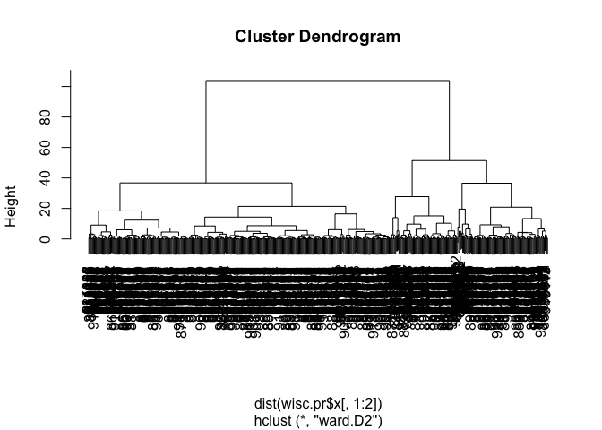

# Class 8 Mini-Project
Kate Zhou (PID: A17373286)

- [Background](#background)
- [Data Import](#data-import)
- [Clustering](#clustering)
- [Principal Component Analysis](#principal-component-analysis)
  - [The importance of data scaling](#the-importance-of-data-scaling)
  - [PCA of wisc.data](#pca-of-wiscdata)
- [5. Combining Methods](#5-combining-methods)
  - [Clustering on PCA results](#clustering-on-pca-results)
- [7. Prediction](#7-prediction)

## Background

This mini-project explores a complete analysis using the unsupervised
learning techniques covered in class. You’ll extend what you’ve learned
by combining PCA as a preprocessing step to clustering using data that
consist of measurements of cell nuclei of human breast masses. This
expands on our RNA-Seq analysis from last day.

## Data Import

Our data come from the U. of Wisconsin Medical Center

``` r
# Save your input data file into your Project directory
fna.data <- "WisconsinCancer.csv"

# Complete the following code to input the data and store as wisc.df
wisc.df <- read.csv(fna.data, row.names=1)
```

> Q1. How many patients/datapoints are in this dataset?

``` r
nrow(wisc.df)
```

    [1] 569

> Q2. How many of the observation have a malignant diagnosis?

``` r
sum(wisc.df$diagnosis == "M")
```

    [1] 212

> Q3. How many variables/features in the data are sufficed with
> “\_mean”?

``` r
colnames(wisc.df)
```

     [1] "diagnosis"               "radius_mean"            
     [3] "texture_mean"            "perimeter_mean"         
     [5] "area_mean"               "smoothness_mean"        
     [7] "compactness_mean"        "concavity_mean"         
     [9] "concave.points_mean"     "symmetry_mean"          
    [11] "fractal_dimension_mean"  "radius_se"              
    [13] "texture_se"              "perimeter_se"           
    [15] "area_se"                 "smoothness_se"          
    [17] "compactness_se"          "concavity_se"           
    [19] "concave.points_se"       "symmetry_se"            
    [21] "fractal_dimension_se"    "radius_worst"           
    [23] "texture_worst"           "perimeter_worst"        
    [25] "area_worst"              "smoothness_worst"       
    [27] "compactness_worst"       "concavity_worst"        
    [29] "concave.points_worst"    "symmetry_worst"         
    [31] "fractal_dimension_worst"

``` r
length(grep("_mean", colnames(wisc.df)))
```

    [1] 10

There is a diagnosis column that is the clinican consenus that I wnat to
exclude from any further analysis. We will come back later and compare
our results to this diasgnosis.

``` r
diagnosis <- as.factor(wisc.df$diagnosis)
diagnosis
```

      [1] M M M M M M M M M M M M M M M M M M M B B B M M M M M M M M M M M M M M M
     [38] B M M M M M M M M B M B B B B B M M B M M B B B B M B M M B B B B M B M M
     [75] B M B M M B B B M M B M M M B B B M B B M M B B B M M B B B B M B B M B B
    [112] B B B B B B M M M B M M B B B M M B M B M M B M M B B M B B M B B B B M B
    [149] B B B B B B B B M B B B B M M B M B B M M B B M M B B B B M B B M M M B M
    [186] B M B B B M B B M M B M M M M B M M M B M B M B B M B M M M M B B M M B B
    [223] B M B B B B B M M B B M B B M M B M B B B B M B B B B B M B M M M M M M M
    [260] M M M M M M M B B B B B B M B M B B M B B M B M M B B B B B B B B B B B B
    [297] B M B B M B M B B B B B B B B B B B B B B M B B B M B M B B B B M M M B B
    [334] B B M B M B M B B B M B B B B B B B M M M B B B B B B B B B B B M M B M M
    [371] M B M M B B B B B M B B B B B M B B B M B B M M B B B B B B M B B B B B B
    [408] B M B B B B B M B B M B B B B B B B B B B B B M B M M B M B B B B B M B B
    [445] M B M B B M B M B B B B B B B B M M B B B B B B M B B B B B B B B B B M B
    [482] B B B B B B M B M B B M B B B B B M M B M B M B B B B B M B B M B M B M M
    [519] B B B M B B B B B B B B B B B M B M M B B B B B B B B B B B B B B B B B B
    [556] B B B B B B B M M M M M M B
    Levels: B M

Now we can remove it from the `wisc.df`

``` r
wisc.df <- wisc.df[,-1]
```

``` r
wisc.df[1, 1]
```

    [1] 17.99

## Clustering

Let’s try a `hclust()`

``` r
hc <- hclust(dist(wisc.df))
plot(hc)
```


We can extract clusters from this rather poor dendrogram/tree with the
`cutree()`

``` r
grps <- cutree(hc, k=2)
```

``` r
table(diagnosis)
```

    diagnosis
      B   M 
    357 212 

We can generate a cross-table compares our cluster `grps` vector with
our `diagnosis` vector values

``` r
table(diagnosis, grps)
```

             grps
    diagnosis   1   2
            B 357   0
            M 192  20

## Principal Component Analysis

### The importance of data scaling

The main function for PCA in base R is `prcomp()` it has a default input
parameter of `scale=False`.

``` r
#prcomp()
head(mtcars)
```

                       mpg cyl disp  hp drat    wt  qsec vs am gear carb
    Mazda RX4         21.0   6  160 110 3.90 2.620 16.46  0  1    4    4
    Mazda RX4 Wag     21.0   6  160 110 3.90 2.875 17.02  0  1    4    4
    Datsun 710        22.8   4  108  93 3.85 2.320 18.61  1  1    4    1
    Hornet 4 Drive    21.4   6  258 110 3.08 3.215 19.44  1  0    3    1
    Hornet Sportabout 18.7   8  360 175 3.15 3.440 17.02  0  0    3    2
    Valiant           18.1   6  225 105 2.76 3.460 20.22  1  0    3    1

we could do a PCA of this data, could be misleading

``` r
pc <- prcomp(mtcars)
biplot(pc)
```


Let’s look at the mean values of each column and their standard
deviation.

``` r
colMeans(mtcars)
```

           mpg        cyl       disp         hp       drat         wt       qsec 
     20.090625   6.187500 230.721875 146.687500   3.596563   3.217250  17.848750 
            vs         am       gear       carb 
      0.437500   0.406250   3.687500   2.812500 

``` r
apply(mtcars, 2, sd)
```

            mpg         cyl        disp          hp        drat          wt 
      6.0269481   1.7859216 123.9386938  68.5628685   0.5346787   0.9784574 
           qsec          vs          am        gear        carb 
      1.7869432   0.5040161   0.4989909   0.7378041   1.6152000 

We can “scale” this data before PCA to gwet a much better representation
and analysis of all the columns.

``` r
mtscale <- scale(mtcars)
```

``` r
colMeans(mtscale)
```

              mpg           cyl          disp            hp          drat 
     6.678685e-16 -6.938894e-18 -2.949030e-16 -2.428613e-17 -1.113692e-15 
               wt          qsec            vs            am          gear 
     5.221518e-16 -1.465841e-15  1.387779e-17  8.326673e-17 -5.030698e-17 
             carb 
     1.387779e-17 

``` r
apply(mtscale, 2, sd)
```

     mpg  cyl disp   hp drat   wt qsec   vs   am gear carb 
       1    1    1    1    1    1    1    1    1    1    1 

``` r
pc.scale <- prcomp(mtscale)
```

We can look at the two main result figures from PCA - the “PC plot”
(a.k.a score plot, ordienation plot, or PC1 vs PC2 plot). The “loadings
plot” how the original variables contribute to the new PCs.

``` r
pc.scale
```

    Standard deviations (1, .., p=11):
     [1] 2.5706809 1.6280258 0.7919579 0.5192277 0.4727061 0.4599958 0.3677798
     [8] 0.3505730 0.2775728 0.2281128 0.1484736

    Rotation (n x k) = (11 x 11):
                PC1         PC2         PC3          PC4         PC5         PC6
    mpg  -0.3625305  0.01612440 -0.22574419 -0.022540255 -0.10284468 -0.10879743
    cyl   0.3739160  0.04374371 -0.17531118 -0.002591838 -0.05848381  0.16855369
    disp  0.3681852 -0.04932413 -0.06148414  0.256607885 -0.39399530 -0.33616451
    hp    0.3300569  0.24878402  0.14001476 -0.067676157 -0.54004744  0.07143563
    drat -0.2941514  0.27469408  0.16118879  0.854828743 -0.07732727  0.24449705
    wt    0.3461033 -0.14303825  0.34181851  0.245899314  0.07502912 -0.46493964
    qsec -0.2004563 -0.46337482  0.40316904  0.068076532  0.16466591 -0.33048032
    vs   -0.3065113 -0.23164699  0.42881517 -0.214848616 -0.59953955  0.19401702
    am   -0.2349429  0.42941765 -0.20576657 -0.030462908 -0.08978128 -0.57081745
    gear -0.2069162  0.46234863  0.28977993 -0.264690521 -0.04832960 -0.24356284
    carb  0.2140177  0.41357106  0.52854459 -0.126789179  0.36131875  0.18352168
                  PC7          PC8          PC9        PC10         PC11
    mpg   0.367723810  0.754091423 -0.235701617 -0.13928524 -0.124895628
    cyl   0.057277736  0.230824925 -0.054035270  0.84641949 -0.140695441
    disp  0.214303077 -0.001142134 -0.198427848 -0.04937979  0.660606481
    hp   -0.001495989  0.222358441  0.575830072 -0.24782351 -0.256492062
    drat  0.021119857 -0.032193501  0.046901228  0.10149369 -0.039530246
    wt   -0.020668302  0.008571929 -0.359498251 -0.09439426 -0.567448697
    qsec  0.050010522  0.231840021  0.528377185  0.27067295  0.181361780
    vs   -0.265780836 -0.025935128 -0.358582624  0.15903909  0.008414634
    am   -0.587305101  0.059746952  0.047403982  0.17778541  0.029823537
    gear  0.605097617 -0.336150240  0.001735039  0.21382515 -0.053507085
    carb -0.174603192  0.395629107 -0.170640677 -0.07225950  0.319594676

A loading

``` r
library(ggplot2)

ggplot(pc$rotation) +
  aes(PC1, rownames(pc$rotation)) +
  geom_col()
```


``` r
library(ggplot2)

ggplot(pc.scale$rotation) +
  aes(PC1, rownames(pc.scale$rotation)) +
  geom_col()
```


PC plot of scaled PCA results

``` r
library(ggrepel)
ggplot(pc.scale$x) +
  aes(PC1, PC2, label=rownames(pc.scale$x)) +
  geom_point() +
  geom_text_repel()
```

    Warning: ggrepel: 6 unlabeled data points (too many overlaps). Consider
    increasing max.overlaps


> Key point: In general we will set `scale=TRUE` when we do PCA. This is
> not the default but probably should be…

We can check the SD and mean of the differnt columns in `wisc.data` to
see if we need to scale - hint: we do!

### PCA of wisc.data

``` r
wisc.pr <- prcomp(wisc.df, scale=TRUE)
```

``` r
summary(wisc.pr)
```

    Importance of components:
                              PC1    PC2     PC3     PC4     PC5     PC6     PC7
    Standard deviation     3.6444 2.3857 1.67867 1.40735 1.28403 1.09880 0.82172
    Proportion of Variance 0.4427 0.1897 0.09393 0.06602 0.05496 0.04025 0.02251
    Cumulative Proportion  0.4427 0.6324 0.72636 0.79239 0.84734 0.88759 0.91010
                               PC8    PC9    PC10   PC11    PC12    PC13    PC14
    Standard deviation     0.69037 0.6457 0.59219 0.5421 0.51104 0.49128 0.39624
    Proportion of Variance 0.01589 0.0139 0.01169 0.0098 0.00871 0.00805 0.00523
    Cumulative Proportion  0.92598 0.9399 0.95157 0.9614 0.97007 0.97812 0.98335
                              PC15    PC16    PC17    PC18    PC19    PC20   PC21
    Standard deviation     0.30681 0.28260 0.24372 0.22939 0.22244 0.17652 0.1731
    Proportion of Variance 0.00314 0.00266 0.00198 0.00175 0.00165 0.00104 0.0010
    Cumulative Proportion  0.98649 0.98915 0.99113 0.99288 0.99453 0.99557 0.9966
                              PC22    PC23   PC24    PC25    PC26    PC27    PC28
    Standard deviation     0.16565 0.15602 0.1344 0.12442 0.09043 0.08307 0.03987
    Proportion of Variance 0.00091 0.00081 0.0006 0.00052 0.00027 0.00023 0.00005
    Cumulative Proportion  0.99749 0.99830 0.9989 0.99942 0.99969 0.99992 0.99997
                              PC29    PC30
    Standard deviation     0.02736 0.01153
    Proportion of Variance 0.00002 0.00000
    Cumulative Proportion  1.00000 1.00000

Let’s make the main PC1 vs PC2

``` r
ggplot(wisc.pr$x) +
  aes(PC1, PC2, col=diagnosis) +
  geom_point() +
  xlab("PC1(44.27%)") +
  ylab("PC2(18.97%)")
```


> Q4. From your results, what proportion of the original variance is
> captured by the first principal components (PC1)? 44.27%

> Q5. How many principal components (PCs) are required to describe at
> least 70% of the original variance in the data? 3

> Q6. How many principal components (PCs) are required to describe at
> least 90% of the original variance in the data? 7

> Q7. What stands out to you about this plot? Is it easy or difficult to
> understand? Why?

``` r
biplot(wisc.pr)
```


The graph capture the same information as the ggplot for PC1 and PC2.
There are two noticeable cluster label in red and black

> Q8. Generate a similar plot for principal components 1 and 3. What do
> you notice about these plots?

``` r
ggplot(wisc.pr$x) +
  aes(PC1, PC3, col=diagnosis) +
  geom_point() +
  xlab("PC1(44.27%)") +
  ylab("PC3(9.393%)")
```


There is a red dots cluster on the right and blue dots cluster on the
left. PC1 axis 0 value seem to separate the two cluster.

> Q9. For the first principal component, what is the component of the
> loading vector (i.e. wisc.pr\$rotation\[,1\]) for the feature
> concave.points_mean?

``` r
wisc.pr$rotation["concave.points_mean", 1]
```

    [1] -0.2608538

> Q10. What is the minimum number of principal components required to
> explain 80% of the variance of the data?

PC5 Explains 84.734% of variance

## 5. Combining Methods

We can take our PCA results and use them as a basis set for other
analysis such as clustering

### Clustering on PCA results

``` r
wisc.pr.hclust <- hclust(dist(wisc.pr$x[,1:2]), method="ward.D2")
plot(wisc.pr.hclust)
```



We can “cut” this tree to yield our clusters (groups):

``` r
pc.grps <- cutree(wisc.pr.hclust, k = 2)
table(pc.grps)
```

    pc.grps
      1   2 
    195 374 

How do my cluster grps compare to the expert diagnosis?

``` r
table(diagnosis, pc.grps)
```

             pc.grps
    diagnosis   1   2
            B  18 339
            M 177  35

> Q15. How well does the newly created model with four clusters separate
> out the two diagnoses? Better, but there are still misclassified
> points. Group 1 has 18 B, group 2 has 35 M that are misclassifed.

> Q16. How well do the hierarchical clustering models you created in
> previous sections (i.e. before PCA) do in terms of separating the
> diagnoses? Again, use the table() function to compare the output of
> each model (wisc.km\$cluster and wisc.hclust.clusters) with the vector
> containing the actual diagnoses.

They did really badly before PCA. We did much better after PCA - the new
PCA variables (what we called a basis set) give us much better
seperation of M and B.

## 7. Prediction

We can use our PCA model for the analysis of the new “unseen” data. In
this case from U. Mich.

``` r
url <- "https://tinyurl.com/new-samples-CSV"
new <- read.csv(url)
npc <- predict(wisc.pr, newdata=new)
npc
```

               PC1       PC2        PC3        PC4       PC5        PC6        PC7
    [1,]  2.576616 -3.135913  1.3990492 -0.7631950  2.781648 -0.8150185 -0.3959098
    [2,] -4.754928 -3.009033 -0.1660946 -0.6052952 -1.140698 -1.2189945  0.8193031
                PC8       PC9       PC10      PC11      PC12      PC13     PC14
    [1,] -0.2307350 0.1029569 -0.9272861 0.3411457  0.375921 0.1610764 1.187882
    [2,] -0.3307423 0.5281896 -0.4855301 0.7173233 -1.185917 0.5893856 0.303029
              PC15       PC16        PC17        PC18        PC19       PC20
    [1,] 0.3216974 -0.1743616 -0.07875393 -0.11207028 -0.08802955 -0.2495216
    [2,] 0.1299153  0.1448061 -0.40509706  0.06565549  0.25591230 -0.4289500
               PC21       PC22       PC23       PC24        PC25         PC26
    [1,]  0.1228233 0.09358453 0.08347651  0.1223396  0.02124121  0.078884581
    [2,] -0.1224776 0.01732146 0.06316631 -0.2338618 -0.20755948 -0.009833238
                 PC27        PC28         PC29         PC30
    [1,]  0.220199544 -0.02946023 -0.015620933  0.005269029
    [2,] -0.001134152  0.09638361  0.002795349 -0.019015820

``` r
g <- as.factor(grps)
levels(g)
```

    [1] "1" "2"

``` r
g <- relevel(g,2)
levels(g)
```

    [1] "2" "1"

``` r
plot(wisc.pr$x[,1:2], col=as.factor(g))
points(npc[,1], npc[,2], col="blue", pch=16, cex=3)
text(npc[,1], npc[,2], c(1,2), col="white")
```


> Q18. Which of these new patients should we prioritize for follow up
> based on your results?

Group 1 patients
