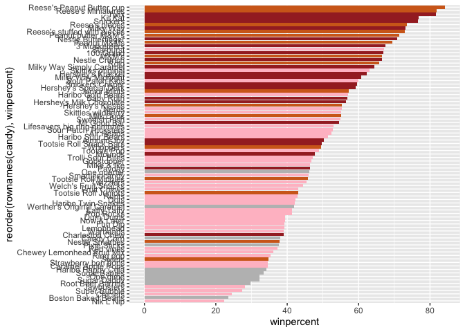

# Class09
Kate Zhou(PID: A17373286)

- [Data Import](#data-import)
- [Exploratory Analysis](#exploratory-analysis)
- [Winpercent Vs Pricepercent](#winpercent-vs-pricepercent)
- [5. Correlation Structure](#5-correlation-structure)
- [Principal Component Analysis(PCA)](#principal-component-analysispca)

Today we wil be taking a small step back to look at some data we can
taste and explore the correlation structure an principal components of
some Halloween candy.

## Data Import

``` r
candy_file <- "candy-data.txt"
candy = read.csv(candy_file, row.names=1)
head(candy)
```

                 chocolate fruity caramel peanutyalmondy nougat crispedricewafer
    100 Grand            1      0       1              0      0                1
    3 Musketeers         1      0       0              0      1                0
    One dime             0      0       0              0      0                0
    One quarter          0      0       0              0      0                0
    Air Heads            0      1       0              0      0                0
    Almond Joy           1      0       0              1      0                0
                 hard bar pluribus sugarpercent pricepercent winpercent
    100 Grand       0   1        0        0.732        0.860   66.97173
    3 Musketeers    0   1        0        0.604        0.511   67.60294
    One dime        0   0        0        0.011        0.116   32.26109
    One quarter     0   0        0        0.011        0.511   46.11650
    Air Heads       0   0        0        0.906        0.511   52.34146
    Almond Joy      0   1        0        0.465        0.767   50.34755

> Q1. How many different candy types are in this dataset?

``` r
dim(candy)
```

    [1] 85 12

> Q2. How many fruity candy types are in the dataset?

``` r
sum(candy$fruity)
```

    [1] 38

> Q3. What is your favorite candy in the dataset and what is it’s
> winpercent value?

``` r
candy["Twix", ]$winpercent
```

    [1] 81.64291

> Q4. What is the winpercent value for “Kit Kat”?

``` r
candy["Kit Kat", ]$winpercent
```

    [1] 76.7686

> Q5. What is the winpercent value for “Tootsie Roll Snack Bars”?

``` r
candy["Tootsie Roll Snack Bars", ]$winpercent
```

    [1] 49.6535

## Exploratory Analysis

We can use the **skimr** pacage to get a quick overview of a given
dataset. This can be useful for the first time you encouter a new
dataset.

``` r
skimr::skim(candy)
```

|                                                  |       |
|:-------------------------------------------------|:------|
| Name                                             | candy |
| Number of rows                                   | 85    |
| Number of columns                                | 12    |
| \_\_\_\_\_\_\_\_\_\_\_\_\_\_\_\_\_\_\_\_\_\_\_   |       |
| Column type frequency:                           |       |
| numeric                                          | 12    |
| \_\_\_\_\_\_\_\_\_\_\_\_\_\_\_\_\_\_\_\_\_\_\_\_ |       |
| Group variables                                  | None  |

Data summary

**Variable type: numeric**

| skim_variable | n_missing | complete_rate | mean | sd | p0 | p25 | p50 | p75 | p100 | hist |
|:---|---:|---:|---:|---:|---:|---:|---:|---:|---:|:---|
| chocolate | 0 | 1 | 0.44 | 0.50 | 0.00 | 0.00 | 0.00 | 1.00 | 1.00 | ▇▁▁▁▆ |
| fruity | 0 | 1 | 0.45 | 0.50 | 0.00 | 0.00 | 0.00 | 1.00 | 1.00 | ▇▁▁▁▆ |
| caramel | 0 | 1 | 0.16 | 0.37 | 0.00 | 0.00 | 0.00 | 0.00 | 1.00 | ▇▁▁▁▂ |
| peanutyalmondy | 0 | 1 | 0.16 | 0.37 | 0.00 | 0.00 | 0.00 | 0.00 | 1.00 | ▇▁▁▁▂ |
| nougat | 0 | 1 | 0.08 | 0.28 | 0.00 | 0.00 | 0.00 | 0.00 | 1.00 | ▇▁▁▁▁ |
| crispedricewafer | 0 | 1 | 0.08 | 0.28 | 0.00 | 0.00 | 0.00 | 0.00 | 1.00 | ▇▁▁▁▁ |
| hard | 0 | 1 | 0.18 | 0.38 | 0.00 | 0.00 | 0.00 | 0.00 | 1.00 | ▇▁▁▁▂ |
| bar | 0 | 1 | 0.25 | 0.43 | 0.00 | 0.00 | 0.00 | 0.00 | 1.00 | ▇▁▁▁▂ |
| pluribus | 0 | 1 | 0.52 | 0.50 | 0.00 | 0.00 | 1.00 | 1.00 | 1.00 | ▇▁▁▁▇ |
| sugarpercent | 0 | 1 | 0.48 | 0.28 | 0.01 | 0.22 | 0.47 | 0.73 | 0.99 | ▇▇▇▇▆ |
| pricepercent | 0 | 1 | 0.47 | 0.29 | 0.01 | 0.26 | 0.47 | 0.65 | 0.98 | ▇▇▇▇▆ |
| winpercent | 0 | 1 | 50.32 | 14.71 | 22.45 | 39.14 | 47.83 | 59.86 | 84.18 | ▃▇▆▅▂ |

> Q6. Is there any variable/column that looks to be on a different scale
> to the majority of the other columns in the dataset?

It looks like the last column `candy$winpercent` is on a different scale
to all others.

> Q7. What do you think a zero and one represent for the
> candy\$chocolate column?

0 means False (isn’t chocolate), 1 means True (is chocolate)

> Q8. Plot a histogram of winpercent values

``` r
hist(candy$winpercent, breaks=10)
```


> Q9. Is the distribution of winpercent values symmetrical?

``` r
library(ggplot2)
ggplot(candy) +
  aes(winpercent) +
  geom_histogram(bins=10, fill="lightblue", col="skyblue")
```


No symmetric

> Q10. Is the center of the distribution above or below 50%?

``` r
summary(candy$winpercent)
```

       Min. 1st Qu.  Median    Mean 3rd Qu.    Max. 
      22.45   39.14   47.83   50.32   59.86   84.18 

The center of distribution (Median) is below 50%.

> Q11. On average is chocolate candy higher or lower ranked than fruit
> candy?

Chocolate is higher ranked than fruity candy

``` r
choc.candy <- candy[candy$chocolate==1,] 
choc.win <- choc.candy$winpercent
fru.candy <- candy[candy$fruity==1,] 
fru.win <- fru.candy$winpercent
mean(choc.win)
```

    [1] 60.92153

``` r
mean(fru.win)
```

    [1] 44.11974

> Q12. Is this difference statistically significant?

``` r
ans <- t.test(choc.win, fru.win)
ans
```


        Welch Two Sample t-test

    data:  choc.win and fru.win
    t = 6.2582, df = 68.882, p-value = 2.871e-08
    alternative hypothesis: true difference in means is not equal to 0
    95 percent confidence interval:
     11.44563 22.15795
    sample estimates:
    mean of x mean of y 
     60.92153  44.11974 

Yes, with a P-value 2.8713778^{-8}.

> Q13. What are the five least liked candy types in this set?

There are two related runctions that can help here, one is the classic
`sort()` and `order()`

``` r
x <- c (5, 10, 1, 4)
sort(x)
```

    [1]  1  4  5 10

``` r
x <- c (5, 10, 1, 4)
order(x)
```

    [1] 3 4 1 2

``` r
inds <- order(candy$winpercent, decreasing = 1)
head(candy[inds,])
```

                              chocolate fruity caramel peanutyalmondy nougat
    Reese's Peanut Butter cup         1      0       0              1      0
    Reese's Miniatures                1      0       0              1      0
    Twix                              1      0       1              0      0
    Kit Kat                           1      0       0              0      0
    Snickers                          1      0       1              1      1
    Reese's pieces                    1      0       0              1      0
                              crispedricewafer hard bar pluribus sugarpercent
    Reese's Peanut Butter cup                0    0   0        0        0.720
    Reese's Miniatures                       0    0   0        0        0.034
    Twix                                     1    0   1        0        0.546
    Kit Kat                                  1    0   1        0        0.313
    Snickers                                 0    0   1        0        0.546
    Reese's pieces                           0    0   0        1        0.406
                              pricepercent winpercent
    Reese's Peanut Butter cup        0.651   84.18029
    Reese's Miniatures               0.279   81.86626
    Twix                             0.906   81.64291
    Kit Kat                          0.511   76.76860
    Snickers                         0.651   76.67378
    Reese's pieces                   0.651   73.43499

``` r
dec <- order(candy$winpercent)
candy[dec[1:5],]
```

                       chocolate fruity caramel peanutyalmondy nougat
    Nik L Nip                  0      1       0              0      0
    Boston Baked Beans         0      0       0              1      0
    Chiclets                   0      1       0              0      0
    Super Bubble               0      1       0              0      0
    Jawbusters                 0      1       0              0      0
                       crispedricewafer hard bar pluribus sugarpercent pricepercent
    Nik L Nip                         0    0   0        1        0.197        0.976
    Boston Baked Beans                0    0   0        1        0.313        0.511
    Chiclets                          0    0   0        1        0.046        0.325
    Super Bubble                      0    0   0        0        0.162        0.116
    Jawbusters                        0    1   0        1        0.093        0.511
                       winpercent
    Nik L Nip            22.44534
    Boston Baked Beans   23.41782
    Chiclets             24.52499
    Super Bubble         27.30386
    Jawbusters           28.12744

> Q14. What are the top 5 all time favorite candy types out of this set?

``` r
candy[inds[1:5],]
```

                              chocolate fruity caramel peanutyalmondy nougat
    Reese's Peanut Butter cup         1      0       0              1      0
    Reese's Miniatures                1      0       0              1      0
    Twix                              1      0       1              0      0
    Kit Kat                           1      0       0              0      0
    Snickers                          1      0       1              1      1
                              crispedricewafer hard bar pluribus sugarpercent
    Reese's Peanut Butter cup                0    0   0        0        0.720
    Reese's Miniatures                       0    0   0        0        0.034
    Twix                                     1    0   1        0        0.546
    Kit Kat                                  1    0   1        0        0.313
    Snickers                                 0    0   1        0        0.546
                              pricepercent winpercent
    Reese's Peanut Butter cup        0.651   84.18029
    Reese's Miniatures               0.279   81.86626
    Twix                             0.906   81.64291
    Kit Kat                          0.511   76.76860
    Snickers                         0.651   76.67378

> Q15. Make a first barplot of candy ranking based on winpercent values.

Make a bar plot with ggplot and order it by winpercent values

``` r
ggplot(candy) +
  aes(winpercent, rownames(candy)) +
  geom_col()
```


> Q16. This is quite ugly, use the reorder() function to get the bars
> sorted by winpercent?

``` r
ggplot(candy) +
  aes(x=winpercent, 
      y=reorder(rownames(candy), winpercent),
      fill=chocolate) +
  geom_col()
```


Here we want a custom color vector to color each bar the way we want -
with `chocolate` and `fruity` candy together with whether it is a `bar`
or not

``` r
mycols <- rep("grey", nrow(candy))
mycols[as.logical(candy$chocolate)] <- "chocolate"
mycols[as.logical(candy$fruity)] <- "pink"
mycols[as.logical(candy$bar)] <- "brown"

ggplot(candy) +
  aes(x=winpercent, 
      y=reorder(rownames(candy), winpercent)) +
  geom_col(fill=mycols)
```



``` r
ggsave("mybarplot.png", width=4, height=8)
```


> Q17. What is the worst ranked chocolate candy?

``` r
worst <- candy[dec,]
worst_choc <- worst[worst$chocolate == 1,]
worst_choc[1,]
```

            chocolate fruity caramel peanutyalmondy nougat crispedricewafer hard
    Sixlets         1      0       0              0      0                0    0
            bar pluribus sugarpercent pricepercent winpercent
    Sixlets   0        1         0.22        0.081     34.722

> Q18. What is the best ranked fruity candy?

``` r
best <- candy[inds,]
best_fruit <- best[best$fruity == 1,]
best_fruit[1,]
```

              chocolate fruity caramel peanutyalmondy nougat crispedricewafer hard
    Starburst         0      1       0              0      0                0    0
              bar pluribus sugarpercent pricepercent winpercent
    Starburst   0        1        0.151         0.22   67.03763

## Winpercent Vs Pricepercent

``` r
library(ggrepel)

mycols <- rep("grey", nrow(candy))
mycols[as.logical(candy$chocolate)] <- "chocolate"
mycols[as.logical(candy$fruity)] <- "red"
mycols[as.logical(candy$bar)] <- "brown"

# How about a plot of price vs win
ggplot(candy) +
  aes(winpercent, pricepercent, label=rownames(candy)) +
  geom_point(col=mycols) + 
  geom_text_repel(col=mycols, size=3.3, max.overlaps = 5)
```

    Warning: ggrepel: 50 unlabeled data points (too many overlaps). Consider
    increasing max.overlaps


> Q19. Which candy type is the highest ranked in terms of winpercent for
> the least money - i.e. offers the most bang for your buck?

Reese’s Miniatures.

> Q20. What are the top 5 most expensive candy types in the dataset and
> of these which is the least popular?

``` r
expensive5 <- candy[order(candy$pricepercent, decreasing = 1)[1:5],]
expensive5
```

                             chocolate fruity caramel peanutyalmondy nougat
    Nik L Nip                        0      1       0              0      0
    Nestle Smarties                  1      0       0              0      0
    Ring pop                         0      1       0              0      0
    Hershey's Krackel                1      0       0              0      0
    Hershey's Milk Chocolate         1      0       0              0      0
                             crispedricewafer hard bar pluribus sugarpercent
    Nik L Nip                               0    0   0        1        0.197
    Nestle Smarties                         0    0   0        1        0.267
    Ring pop                                0    1   0        0        0.732
    Hershey's Krackel                       1    0   1        0        0.430
    Hershey's Milk Chocolate                0    0   1        0        0.430
                             pricepercent winpercent
    Nik L Nip                       0.976   22.44534
    Nestle Smarties                 0.976   37.88719
    Ring pop                        0.965   35.29076
    Hershey's Krackel               0.918   62.28448
    Hershey's Milk Chocolate        0.918   56.49050

``` r
expensive5[order(expensive5$winpercent)[1],]
```

              chocolate fruity caramel peanutyalmondy nougat crispedricewafer hard
    Nik L Nip         0      1       0              0      0                0    0
              bar pluribus sugarpercent pricepercent winpercent
    Nik L Nip   0        1        0.197        0.976   22.44534

## 5. Correlation Structure

``` r
library(corrplot)
```

    corrplot 0.95 loaded

``` r
cij <- cor(candy)
cij
```

                      chocolate      fruity     caramel peanutyalmondy      nougat
    chocolate         1.0000000 -0.74172106  0.24987535     0.37782357  0.25489183
    fruity           -0.7417211  1.00000000 -0.33548538    -0.39928014 -0.26936712
    caramel           0.2498753 -0.33548538  1.00000000     0.05935614  0.32849280
    peanutyalmondy    0.3778236 -0.39928014  0.05935614     1.00000000  0.21311310
    nougat            0.2548918 -0.26936712  0.32849280     0.21311310  1.00000000
    crispedricewafer  0.3412098 -0.26936712  0.21311310    -0.01764631 -0.08974359
    hard             -0.3441769  0.39067750 -0.12235513    -0.20555661 -0.13867505
    bar               0.5974211 -0.51506558  0.33396002     0.26041960  0.52297636
    pluribus         -0.3396752  0.29972522 -0.26958501    -0.20610932 -0.31033884
    sugarpercent      0.1041691 -0.03439296  0.22193335     0.08788927  0.12308135
    pricepercent      0.5046754 -0.43096853  0.25432709     0.30915323  0.15319643
    winpercent        0.6365167 -0.38093814  0.21341630     0.40619220  0.19937530
                     crispedricewafer        hard         bar    pluribus
    chocolate              0.34120978 -0.34417691  0.59742114 -0.33967519
    fruity                -0.26936712  0.39067750 -0.51506558  0.29972522
    caramel                0.21311310 -0.12235513  0.33396002 -0.26958501
    peanutyalmondy        -0.01764631 -0.20555661  0.26041960 -0.20610932
    nougat                -0.08974359 -0.13867505  0.52297636 -0.31033884
    crispedricewafer       1.00000000 -0.13867505  0.42375093 -0.22469338
    hard                  -0.13867505  1.00000000 -0.26516504  0.01453172
    bar                    0.42375093 -0.26516504  1.00000000 -0.59340892
    pluribus              -0.22469338  0.01453172 -0.59340892  1.00000000
    sugarpercent           0.06994969  0.09180975  0.09998516  0.04552282
    pricepercent           0.32826539 -0.24436534  0.51840654 -0.22079363
    winpercent             0.32467965 -0.31038158  0.42992933 -0.24744787
                     sugarpercent pricepercent winpercent
    chocolate          0.10416906    0.5046754  0.6365167
    fruity            -0.03439296   -0.4309685 -0.3809381
    caramel            0.22193335    0.2543271  0.2134163
    peanutyalmondy     0.08788927    0.3091532  0.4061922
    nougat             0.12308135    0.1531964  0.1993753
    crispedricewafer   0.06994969    0.3282654  0.3246797
    hard               0.09180975   -0.2443653 -0.3103816
    bar                0.09998516    0.5184065  0.4299293
    pluribus           0.04552282   -0.2207936 -0.2474479
    sugarpercent       1.00000000    0.3297064  0.2291507
    pricepercent       0.32970639    1.0000000  0.3453254
    winpercent         0.22915066    0.3453254  1.0000000

``` r
corrplot(cij)
```


> Q22. Examining this plot what two variables are anti-correlated
> (i.e. have minus values)?

Chocolate and fruity are negatively correlated

``` r
round(cij["chocolate","fruity"],2)
```

    [1] -0.74

> Q23. Similarly, what two variables are most positively correlated?

``` r
round(cij["chocolate","winpercent"],2)
```

    [1] 0.64

## Principal Component Analysis(PCA)

We need to be sure to scale our imput `candy` data before PCA as we have
`winpercent` column on a different scale to all others in the dataset.

``` r
pca <- prcomp(candy, scale=T)
summary(pca)
```

    Importance of components:
                              PC1    PC2    PC3     PC4    PC5     PC6     PC7
    Standard deviation     2.0788 1.1378 1.1092 1.07533 0.9518 0.81923 0.81530
    Proportion of Variance 0.3601 0.1079 0.1025 0.09636 0.0755 0.05593 0.05539
    Cumulative Proportion  0.3601 0.4680 0.5705 0.66688 0.7424 0.79830 0.85369
                               PC8     PC9    PC10    PC11    PC12
    Standard deviation     0.74530 0.67824 0.62349 0.43974 0.39760
    Proportion of Variance 0.04629 0.03833 0.03239 0.01611 0.01317
    Cumulative Proportion  0.89998 0.93832 0.97071 0.98683 1.00000

First main result figure is my “PCA plot”

``` r
head(pca$x)
```

                        PC1        PC2        PC3        PC4         PC5
    100 Grand    -3.8198617 -0.5935788 -2.1863087 -2.3715957 -0.66236243
    3 Musketeers -2.7960236 -1.5196062  1.4121986  0.6994387 -0.16006665
    One dime      1.2025836  0.1718121  2.0607712 -1.2006782 -0.26977985
    One quarter   0.4486538  0.4519736  1.4764928 -1.0017714 -0.05093737
    Air Heads     0.7028992 -0.5731343 -0.9293893  0.4124566  0.33108524
    Almond Joy   -2.4683383  0.7035501  0.8581089  0.5724974  1.43200435
                         PC6        PC7        PC8        PC9        PC10
    100 Grand    -0.54521840 -0.1434056  0.5772242  0.3791482 -0.15409954
    3 Musketeers  0.38258842  2.0215553 -1.5025750  0.0238327 -0.15523907
    One dime      0.09495053 -0.7722007  0.1556221 -0.4539890 -0.94378362
    One quarter   0.42835404 -0.5908920  0.3591344 -0.6388898  0.09557965
    Air Heads     0.18879160  0.9680808  1.0123933 -1.3830122 -0.57372349
    Almond Joy    1.02227348 -0.6660460  0.6082613 -0.1390599 -0.31277870
                       PC11        PC12
    100 Grand     0.1419038  0.06469883
    3 Musketeers -0.5179272 -0.18394717
    One dime     -0.5158708 -0.51074779
    One quarter  -0.9867194 -0.95827191
    Air Heads    -0.5144537  0.04429924
    Almond Joy    1.0611487  0.18893471

``` r
ggplot(pca$x) +
  aes(PC1, PC2, label=rownames(pca$x)) +
  geom_point(col=mycols) +
  geom_text_repel(max.overlaps = 4, col=mycols) +
  theme_bw()
```

    Warning: ggrepel: 61 unlabeled data points (too many overlaps). Consider
    increasing max.overlaps


The second main PCA result is in the `pca$rotation`, we can plot this to
generate a so-called “loadings” plot.

``` r
head(pca$rotation)
```

                            PC1         PC2         PC3          PC4         PC5
    chocolate        -0.4019466  0.21404160  0.01601358 -0.016673032  0.06603585
    fruity            0.3683883 -0.18304666 -0.13765612 -0.004479829  0.14353533
    caramel          -0.2299709 -0.40349894 -0.13294166 -0.024889542 -0.50730150
    peanutyalmondy   -0.2407155  0.22446919  0.18272802  0.466784287  0.39993025
    nougat           -0.2268102 -0.47016599  0.33970244  0.299581403 -0.18885242
    crispedricewafer -0.2215182  0.09719527 -0.36485542 -0.605594730  0.03465232
                             PC6         PC7        PC8          PC9        PC10
    chocolate        -0.09018950 -0.08360642 -0.4908486 -0.151651568  0.10766136
    fruity           -0.04266105  0.46147889  0.3980580 -0.001248306  0.36206250
    caramel          -0.40346502 -0.44274741  0.2696345  0.019186442  0.22979901
    peanutyalmondy   -0.09416259 -0.25710489  0.4577145  0.381068550 -0.14591236
    nougat            0.09012643  0.36663902 -0.1879396  0.385278987  0.01132345
    crispedricewafer -0.09007640  0.13077042  0.1356774  0.511634999 -0.26481014
                           PC11       PC12
    chocolate         0.1004528 0.69784924
    fruity            0.1749490 0.50624242
    caramel           0.1351582 0.07548984
    peanutyalmondy    0.1124428 0.12972756
    nougat           -0.3895447 0.09223698
    crispedricewafer -0.2261562 0.11727369

``` r
ggplot(pca$rotation) +
  aes(PC1, rownames(pca$rotation)) +
  geom_col()
```


``` r
#reorder(pca$rotation, winpercent)
ggplot(pca$rotation) +
  aes(PC1, reorder(rownames(pca$rotation), PC1), fill =PC1) +
  geom_col()
```


> Q24. What original variables are picked up strongly by PC1 in the
> positive direction? Do these make sense to you?

Fruity, pluribus, hard
