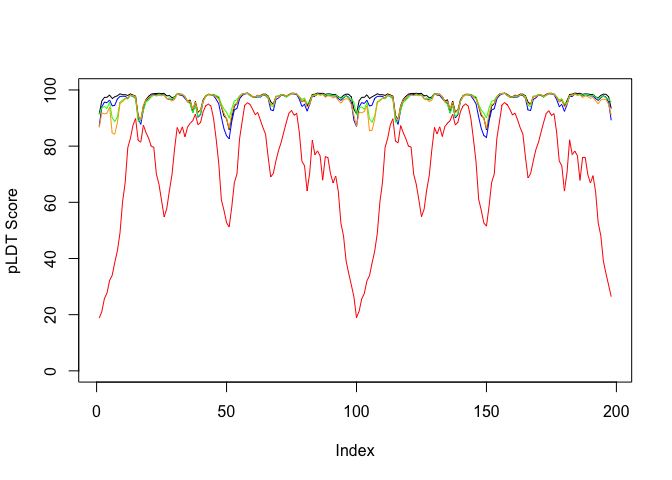

# class11
Kate Zhou (PID:A17373286)

- [Predicted Alignment Error for
  domains](#predicted-alignment-error-for-domains)
- [Score Residue Conservation from alignment
  file](#score-residue-conservation-from-alignment-file)

Here we read the results from AlphaFold and try to interpret all the
models and quality score metrics:

``` r
library(bio3d)

pth <- "dimmer_23119/"
pdb.files <- list.files(path=pth, full.names = TRUE, pattern = ".pdb")
```

Align and superpose all these models

``` r
file.exists(pdb.files)
```

    [1] TRUE TRUE TRUE TRUE TRUE

``` r
pdbs <- pdbaln(pdb.files, fit = TRUE, exefile="msa")
```

    Reading PDB files:
    dimmer_23119//dimmer_23119_unrelaxed_rank_001_alphafold2_multimer_v3_model_2_seed_000.pdb
    dimmer_23119//dimmer_23119_unrelaxed_rank_002_alphafold2_multimer_v3_model_5_seed_000.pdb
    dimmer_23119//dimmer_23119_unrelaxed_rank_003_alphafold2_multimer_v3_model_4_seed_000.pdb
    dimmer_23119//dimmer_23119_unrelaxed_rank_004_alphafold2_multimer_v3_model_1_seed_000.pdb
    dimmer_23119//dimmer_23119_unrelaxed_rank_005_alphafold2_multimer_v3_model_3_seed_000.pdb
    .....

    Extracting sequences

    pdb/seq: 1   name: dimmer_23119//dimmer_23119_unrelaxed_rank_001_alphafold2_multimer_v3_model_2_seed_000.pdb 
    pdb/seq: 2   name: dimmer_23119//dimmer_23119_unrelaxed_rank_002_alphafold2_multimer_v3_model_5_seed_000.pdb 
    pdb/seq: 3   name: dimmer_23119//dimmer_23119_unrelaxed_rank_003_alphafold2_multimer_v3_model_4_seed_000.pdb 
    pdb/seq: 4   name: dimmer_23119//dimmer_23119_unrelaxed_rank_004_alphafold2_multimer_v3_model_1_seed_000.pdb 
    pdb/seq: 5   name: dimmer_23119//dimmer_23119_unrelaxed_rank_005_alphafold2_multimer_v3_model_3_seed_000.pdb 

``` r
#view.pdbs(pdbs)
```

``` r
plot(pdbs$b[1,], typ="l", ylim=c(0, 100), ylab="pLDT Score")
lines(pdbs$b[2,], typ="l", col="blue")
lines(pdbs$b[3,], typ="l", col="green")
lines(pdbs$b[4,], typ="l", col="orange")
lines(pdbs$b[5,], typ="l", col="red")
```



``` r
rd <- rmsd(pdbs, fit=T)
```

    Warning in rmsd(pdbs, fit = T): No indices provided, using the 198 non NA positions

``` r
library(pheatmap)

colnames(rd) <- paste0("m",1:5)
rownames(rd) <- paste0("m",1:5)
pheatmap(rd)
```


# Predicted Alignment Error for domains

``` r
library(jsonlite)

# Listing of all PAE JSON files
pae_files <- list.files(path=pth,
                        pattern=".*model.*\\.json",
                        full.names = TRUE)
```

# Score Residue Conservation from alignment file

AlphaFold returns its’s large alignment file used for analysis. Here we
read this file and score conservation per position

``` r
aln_file <- list.files(path=pth,
                       pattern=".a3m$",
                        full.names = TRUE)
aln_file
```

    [1] "dimmer_23119//dimmer_23119.a3m"

``` r
pdb <- read.pdb("1hsg")
```

      Note: Accessing on-line PDB file

``` r
aln <- read.fasta(aln_file[1], to.upper = TRUE)
```

    [1] " ** Duplicated sequence id's: 101 **"
    [2] " ** Duplicated sequence id's: 101 **"

``` r
sim <- conserv(aln)
plotb3(sim[1:99], sse=trim.pdb(pdb, chain="A"),
       ylab="Conservation Score")
```


Find the consensus sequence at a very high cut-off to find invariant
residues

``` r
con <- consensus(aln, cutoff = 0.9)
con$seq
```

      [1] "-" "-" "-" "-" "-" "-" "-" "-" "-" "-" "-" "-" "-" "-" "-" "-" "-" "-"
     [19] "-" "-" "-" "-" "-" "-" "D" "T" "G" "A" "-" "-" "-" "-" "-" "-" "-" "-"
     [37] "-" "-" "-" "-" "-" "-" "-" "-" "-" "-" "-" "-" "-" "-" "-" "-" "-" "-"
     [55] "-" "-" "-" "-" "-" "-" "-" "-" "-" "-" "-" "-" "-" "-" "-" "-" "-" "-"
     [73] "-" "-" "-" "-" "-" "-" "-" "-" "-" "-" "-" "-" "-" "-" "-" "-" "-" "-"
     [91] "-" "-" "-" "-" "-" "-" "-" "-" "-" "-" "-" "-" "-" "-" "-" "-" "-" "-"
    [109] "-" "-" "-" "-" "-" "-" "-" "-" "-" "-" "-" "-" "-" "-" "-" "-" "-" "-"
    [127] "-" "-" "-" "-" "-" "-"
