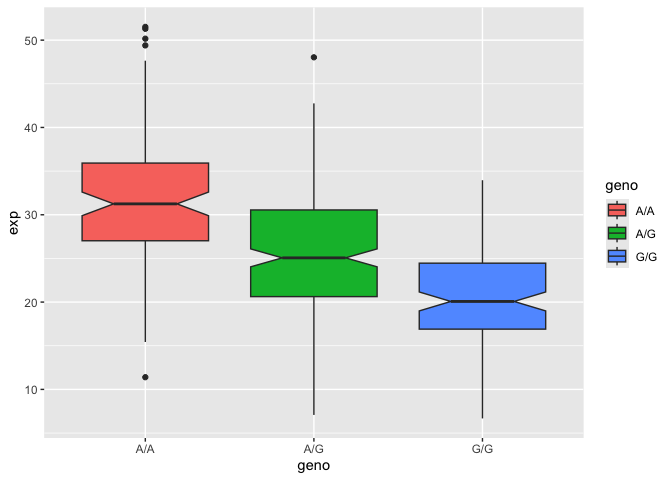

# class12: Population Scale Analysis
Kate Zhou (A17373286)

- [Section 1. Proportion of G/G in a
  population](#section-1-proportion-of-gg-in-a-population)
  - [Section 4 Population Scale
    Analysis](#section-4-population-scale-analysis)

# Section 1. Proportion of G/G in a population

Downloaded a CSV file from Ensemble \<
https://useast.ensembl.org/Homo_sapiens/Location/View?db=core;r=17:39872367-39873367;v=rs12936231;vdb=variation;vf=959765854
\>

Here we read this CSV file

``` r
mxl <- read.csv("373531-SampleGenotypes-Homo_sapiens_Variation_Sample_rs8067378.csv")
head(mxl)
```

      Sample..Male.Female.Unknown. Genotype..forward.strand. Population.s. Father
    1                  NA19648 (F)                       A|A ALL, AMR, MXL      -
    2                  NA19649 (M)                       G|G ALL, AMR, MXL      -
    3                  NA19651 (F)                       A|A ALL, AMR, MXL      -
    4                  NA19652 (M)                       G|G ALL, AMR, MXL      -
    5                  NA19654 (F)                       G|G ALL, AMR, MXL      -
    6                  NA19655 (M)                       A|G ALL, AMR, MXL      -
      Mother
    1      -
    2      -
    3      -
    4      -
    5      -
    6      -

``` r
table(mxl$Genotype..forward.strand.)
```


    A|A A|G G|A G|G 
     22  21  12   9 

``` r
table(mxl$Genotype..forward.strand.) / nrow(mxl) * 100
```


        A|A     A|G     G|A     G|G 
    34.3750 32.8125 18.7500 14.0625 

Now let’s look at a different population. I pick

``` r
gbr <- read.csv("373522-SampleGenotypes-Homo_sapiens_Variation_Sample_rs8067378.csv")
head(gbr)
```

      Sample..Male.Female.Unknown. Genotype..forward.strand. Population.s. Father
    1                  HG00096 (M)                       A|A ALL, EUR, GBR      -
    2                  HG00097 (F)                       G|A ALL, EUR, GBR      -
    3                  HG00099 (F)                       G|G ALL, EUR, GBR      -
    4                  HG00100 (F)                       A|A ALL, EUR, GBR      -
    5                  HG00101 (M)                       A|A ALL, EUR, GBR      -
    6                  HG00102 (F)                       A|A ALL, EUR, GBR      -
      Mother
    1      -
    2      -
    3      -
    4      -
    5      -
    6      -

``` r
table(gbr$Genotype..forward.strand.) / nrow(gbr) * 100
```


         A|A      A|G      G|A      G|G 
    25.27473 18.68132 26.37363 29.67033 

This variant that is associated with childhood asthma is more frequent
in the GBR population than the MKL population.

## Section 4 Population Scale Analysis

One sample is obviously not enough to know what is happening in a
population. You are interested in assessing genetic differences on a
population scale. So, you processed about ~230 samples and did the
normalization on a genome level.

How many samples do we have?

``` r
expr <- read.table("rs8067378_ENSG00000172057.6.txt")
head(expr)
```

       sample geno      exp
    1 HG00367  A/G 28.96038
    2 NA20768  A/G 20.24449
    3 HG00361  A/A 31.32628
    4 HG00135  A/A 34.11169
    5 NA18870  G/G 18.25141
    6 NA11993  A/A 32.89721

``` r
nrow(expr)
```

    [1] 462

``` r
table(expr$geno)
```


    A/A A/G G/G 
    108 233 121 

A/A Median

``` r
median(expr[expr$geno=="A/A",3])
```

    [1] 31.24847

A/G Median

``` r
median(expr[expr$geno=="A/G",3])
```

    [1] 25.06486

G/G Median

``` r
median(expr[expr$geno=="G/G",3])
```

    [1] 20.07363

``` r
library(ggplot2)
```

Let’s make a boxplot

``` r
ggplot(expr) +
  aes(geno, exp, fill=geno) +
  geom_boxplot(notch=TRUE)
```


