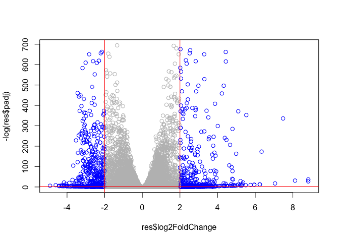
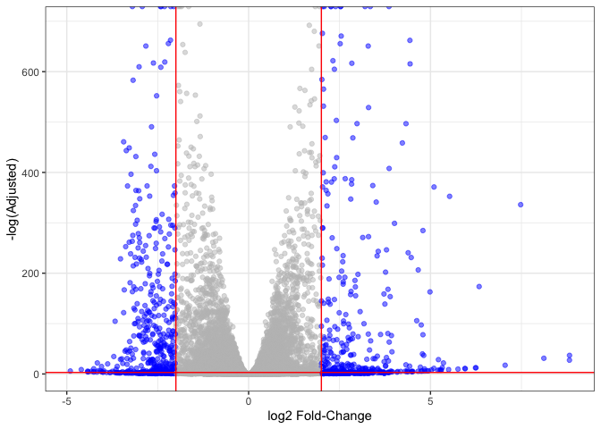
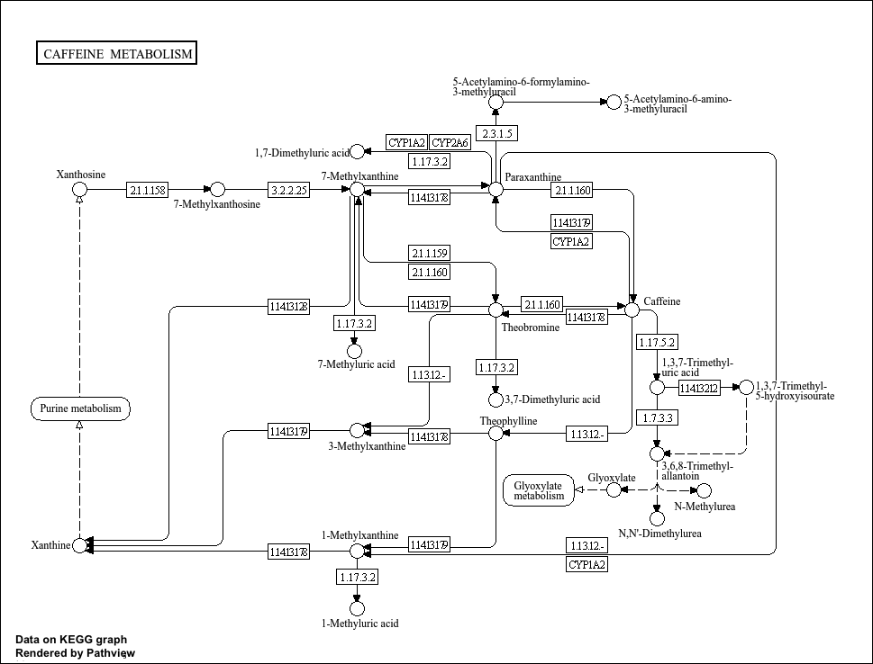
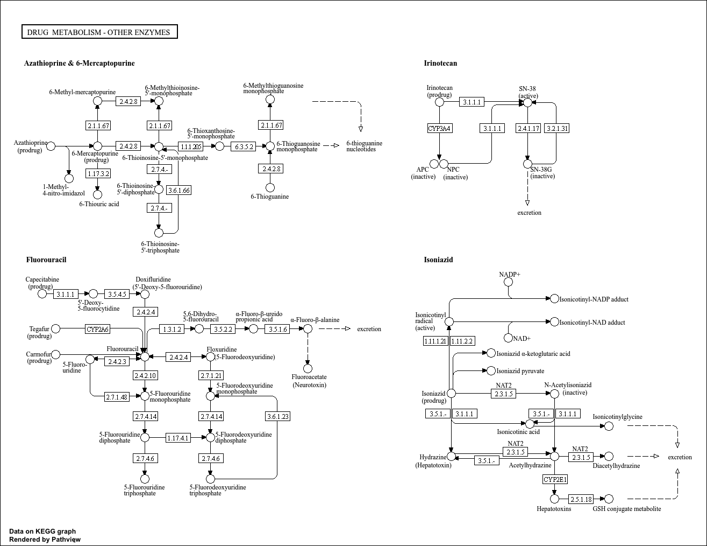
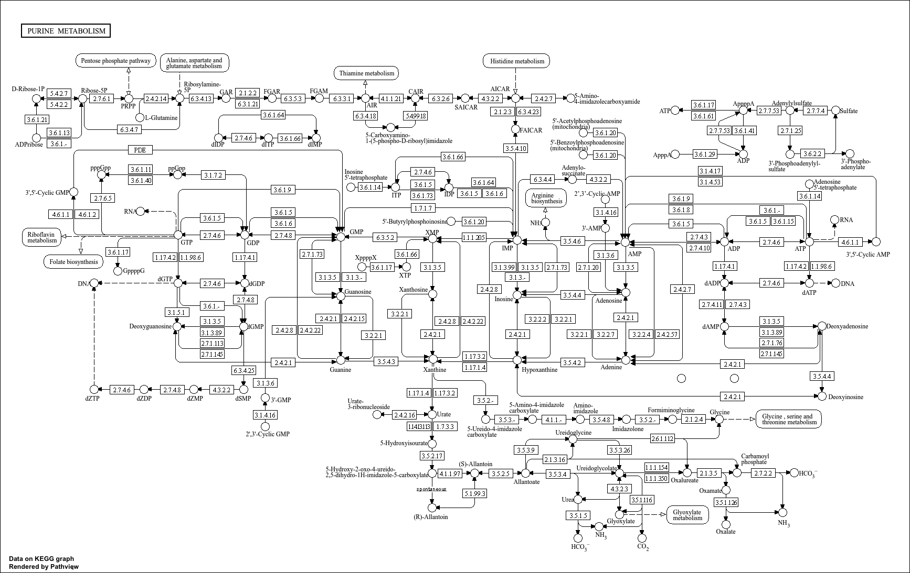
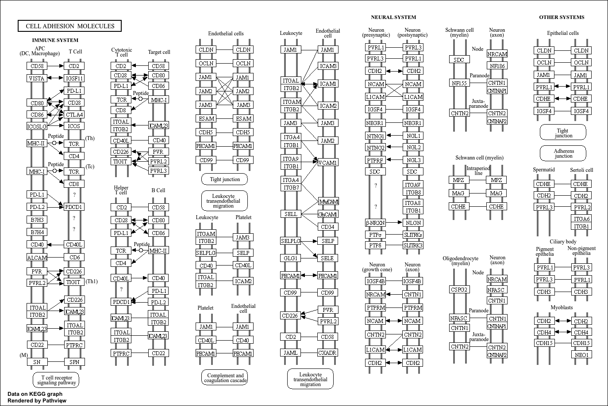
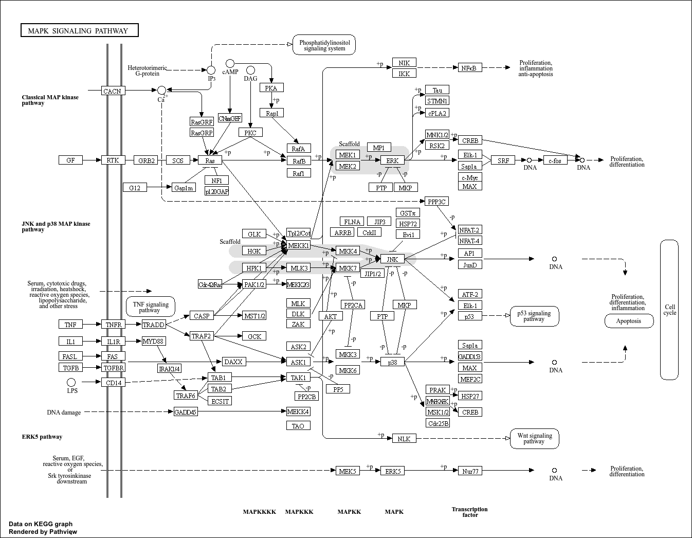

# class14: RNA-Seq analysis mini-project
Kate Zhou (PID:A17373286)

- [Data import](#data-import)
- [Remove zero count genes](#remove-zero-count-genes)
- [Setup DESeq object for analysis](#setup-deseq-object-for-analysis)
- [Run DESeq analysis](#run-deseq-analysis)
- [Extract the result](#extract-the-result)
- [Add Gene annotation](#add-gene-annotation)
- [Save my results to a CSV file](#save-my-results-to-a-csv-file)
- [](#section)
  - [Reactome analysis online](#reactome-analysis-online)

``` r
library(DESeq2)
library(AnnotationDbi)
library(org.Hs.eg.db)
library(pathview)
library(gage)
library(gageData)
```

# Data import

``` r
colData <- read.csv("GSE37704_metadata.csv", row.names=1)
countData <- read.csv("GSE37704_featurecounts.csv", row.names=1)
```

``` r
head(colData)
```

                  condition
    SRR493366 control_sirna
    SRR493367 control_sirna
    SRR493368 control_sirna
    SRR493369      hoxa1_kd
    SRR493370      hoxa1_kd
    SRR493371      hoxa1_kd

``` r
head(countData)
```

                    length SRR493366 SRR493367 SRR493368 SRR493369 SRR493370
    ENSG00000186092    918         0         0         0         0         0
    ENSG00000279928    718         0         0         0         0         0
    ENSG00000279457   1982        23        28        29        29        28
    ENSG00000278566    939         0         0         0         0         0
    ENSG00000273547    939         0         0         0         0         0
    ENSG00000187634   3214       124       123       205       207       212
                    SRR493371
    ENSG00000186092         0
    ENSG00000279928         0
    ENSG00000279457        46
    ENSG00000278566         0
    ENSG00000273547         0
    ENSG00000187634       258

Check the correspondance of colData rows and countData columns.

``` r
rownames(colData)
```

    [1] "SRR493366" "SRR493367" "SRR493368" "SRR493369" "SRR493370" "SRR493371"

``` r
colnames(countData)
```

    [1] "length"    "SRR493366" "SRR493367" "SRR493368" "SRR493369" "SRR493370"
    [7] "SRR493371"

``` r
counts <- countData[,-1]
```

``` r
all(rownames(colData) == colnames(counts))
```

    [1] TRUE

# Remove zero count genes

We will have rows in `counts` for genes that we cannot say anything
about because they have zero expression in the particular tissue we are
looking at.

``` r
head(counts)
```

                    SRR493366 SRR493367 SRR493368 SRR493369 SRR493370 SRR493371
    ENSG00000186092         0         0         0         0         0         0
    ENSG00000279928         0         0         0         0         0         0
    ENSG00000279457        23        28        29        29        28        46
    ENSG00000278566         0         0         0         0         0         0
    ENSG00000273547         0         0         0         0         0         0
    ENSG00000187634       124       123       205       207       212       258

If `rowSums()` is zero then a given gene (i.e. row) has no count data
and we should exclued these genes from future consideration

``` r
cleancounts <- counts[rowSums(counts) != 0, ]
```

> Q. How many genes do we have left?

``` r
nrow(cleancounts)
```

    [1] 15975

# Setup DESeq object for analysis

# Run DESeq analysis

``` r
dds <- DESeqDataSetFromMatrix(countData=cleancounts,
                              colData = colData,
                              design = ~condition)
```

    Warning in DESeqDataSet(se, design = design, ignoreRank): some variables in
    design formula are characters, converting to factors

``` r
dds <- DESeq(dds)
```

    estimating size factors

    estimating dispersions

    gene-wise dispersion estimates

    mean-dispersion relationship

    final dispersion estimates

    fitting model and testing

``` r
res <- results(dds, contrast=c("condition", "hoxa1_kd", "control_sirna"))
```

``` r
mycols <- rep("grey", nrow(res))
mycols[res$log2FoldChange <= -2] <- "blue"
mycols[res$log2FoldChange >= 2] <- "blue"
plot(res$log2FoldChange, -log(res$padj), col=mycols)
abline(v=-2, col= "red")
abline(v=2, col= "red")
abline(h=-log(0.05), col="red")
```



``` r
library(ggplot2)
ggplot(as.data.frame(res)) +
  aes(res$log2FoldChange, -log(res$padj)) +
  geom_point(alpha = 0.5, col=mycols) +
  geom_vline(xintercept = c(-2, 2), col = "red") +
  geom_hline(yintercept = -log(0.05), col = "red") +
  theme_bw() +
  labs(x="log2 Fold-Change",
  y="-log(Adjusted)")
```

    Warning: Removed 1237 rows containing missing values or values outside the scale range
    (`geom_point()`).



# Extract the result

``` r
res <- results(dds)
```

``` r
head(res)
```

    log2 fold change (MLE): condition hoxa1 kd vs control sirna 
    Wald test p-value: condition hoxa1 kd vs control sirna 
    DataFrame with 6 rows and 6 columns
                     baseMean log2FoldChange     lfcSE       stat      pvalue
                    <numeric>      <numeric> <numeric>  <numeric>   <numeric>
    ENSG00000279457   29.9136      0.1792571 0.3248216   0.551863 5.81042e-01
    ENSG00000187634  183.2296      0.4264571 0.1402658   3.040350 2.36304e-03
    ENSG00000188976 1651.1881     -0.6927205 0.0548465 -12.630158 1.43989e-36
    ENSG00000187961  209.6379      0.7297556 0.1318599   5.534326 3.12428e-08
    ENSG00000187583   47.2551      0.0405765 0.2718928   0.149237 8.81366e-01
    ENSG00000187642   11.9798      0.5428105 0.5215599   1.040744 2.97994e-01
                           padj
                      <numeric>
    ENSG00000279457 6.86555e-01
    ENSG00000187634 5.15718e-03
    ENSG00000188976 1.76549e-35
    ENSG00000187961 1.13413e-07
    ENSG00000187583 9.19031e-01
    ENSG00000187642 4.03379e-01

# Add Gene annotation

``` r
res$symbol = mapIds(org.Hs.eg.db,
                    keys=rownames(res), 
                    keytype="ENSEMBL",
                    column="SYMBOL",
                    multiVals="first")
```

    'select()' returned 1:many mapping between keys and columns

``` r
res$entrez = mapIds(org.Hs.eg.db,
                    keys=rownames(res),
                    keytype="ENSEMBL",
                    column="ENTREZID",
                    multiVals="first")
```

    'select()' returned 1:many mapping between keys and columns

``` r
res$name =   mapIds(org.Hs.eg.db,
                    keys=row.names(res),
                    keytype="ENSEMBL",
                    column="ENTREZID",
                    multiVals="first")
```

    'select()' returned 1:many mapping between keys and columns

``` r
head(res, 10)
```

    log2 fold change (MLE): condition hoxa1 kd vs control sirna 
    Wald test p-value: condition hoxa1 kd vs control sirna 
    DataFrame with 10 rows and 9 columns
                       baseMean log2FoldChange     lfcSE       stat      pvalue
                      <numeric>      <numeric> <numeric>  <numeric>   <numeric>
    ENSG00000279457   29.913579      0.1792571 0.3248216   0.551863 5.81042e-01
    ENSG00000187634  183.229650      0.4264571 0.1402658   3.040350 2.36304e-03
    ENSG00000188976 1651.188076     -0.6927205 0.0548465 -12.630158 1.43989e-36
    ENSG00000187961  209.637938      0.7297556 0.1318599   5.534326 3.12428e-08
    ENSG00000187583   47.255123      0.0405765 0.2718928   0.149237 8.81366e-01
    ENSG00000187642   11.979750      0.5428105 0.5215599   1.040744 2.97994e-01
    ENSG00000188290  108.922128      2.0570638 0.1969053  10.446970 1.51282e-25
    ENSG00000187608  350.716868      0.2573837 0.1027266   2.505522 1.22271e-02
    ENSG00000188157 9128.439422      0.3899088 0.0467163   8.346304 7.04321e-17
    ENSG00000237330    0.158192      0.7859552 4.0804729   0.192614 8.47261e-01
                           padj      symbol      entrez        name
                      <numeric> <character> <character> <character>
    ENSG00000279457 6.86555e-01          NA          NA          NA
    ENSG00000187634 5.15718e-03      SAMD11      148398      148398
    ENSG00000188976 1.76549e-35       NOC2L       26155       26155
    ENSG00000187961 1.13413e-07      KLHL17      339451      339451
    ENSG00000187583 9.19031e-01     PLEKHN1       84069       84069
    ENSG00000187642 4.03379e-01       PERM1       84808       84808
    ENSG00000188290 1.30538e-24        HES4       57801       57801
    ENSG00000187608 2.37452e-02       ISG15        9636        9636
    ENSG00000188157 4.21963e-16        AGRN      375790      375790
    ENSG00000237330          NA      RNF223      401934      401934

# Save my results to a CSV file

``` r
write.csv(res, file="results.csv")
```

# 

``` r
data(kegg.sets.hs)
data(sigmet.idx.hs)
kegg.sets.hs = kegg.sets.hs[sigmet.idx.hs]
```

``` r
foldchanges = res$log2FoldChange
names(foldchanges) = res$entrez
pathview(gene.data=foldchanges, pathway.id="hsa04110")
```


``` r
keggres = gage(foldchanges, gsets=kegg.sets.hs)
## Focus on top 5 downregulated pathways here for demo purposes only
keggrespathways <- rownames(keggres$less)[1:5]

# Extract the 8 character long IDs part of each string
keggresids = substr(keggrespathways, start=1, stop=8)
keggresids
```

    [1] "hsa04110" "hsa03030" "hsa03013" "hsa03440" "hsa04114"

``` r
foldchanges = res$log2FoldChange

pathview(gene.data=foldchanges, pathway.id="hsa00232")
```



``` r
foldchanges = res$log2FoldChange

pathview(gene.data=foldchanges, pathway.id="hsa00983")
```



``` r
foldchanges = res$log2FoldChange

pathview(gene.data=foldchanges, pathway.id="hsa00230")
```

    Warning in cbind(blk.ind, j): number of rows of result is not a multiple of
    vector length (arg 2)
    Warning in cbind(blk.ind, j): number of rows of result is not a multiple of
    vector length (arg 2)
    Warning in cbind(blk.ind, j): number of rows of result is not a multiple of
    vector length (arg 2)
    Warning in cbind(blk.ind, j): number of rows of result is not a multiple of
    vector length (arg 2)
    Warning in cbind(blk.ind, j): number of rows of result is not a multiple of
    vector length (arg 2)
    Warning in cbind(blk.ind, j): number of rows of result is not a multiple of
    vector length (arg 2)
    Warning in cbind(blk.ind, j): number of rows of result is not a multiple of
    vector length (arg 2)
    Warning in cbind(blk.ind, j): number of rows of result is not a multiple of
    vector length (arg 2)
    Warning in cbind(blk.ind, j): number of rows of result is not a multiple of
    vector length (arg 2)
    Warning in cbind(blk.ind, j): number of rows of result is not a multiple of
    vector length (arg 2)
    Warning in cbind(blk.ind, j): number of rows of result is not a multiple of
    vector length (arg 2)
    Warning in cbind(blk.ind, j): number of rows of result is not a multiple of
    vector length (arg 2)



``` r
foldchanges = res$log2FoldChange

pathview(gene.data=foldchanges, pathway.id="hsa04514")
```



``` r
foldchanges = res$log2FoldChange

pathview(gene.data=foldchanges, pathway.id="hsa04010")
```



``` r
data(go.sets.hs)
data(go.subs.hs)

# Focus on Biological Process subset of GO
gobpsets = go.sets.hs[go.subs.hs$BP]

gobpres = gage(foldchanges, gsets=gobpsets, same.dir=TRUE)
```

``` r
head(gobpres$less, 5)
```

                                                   p.geomean stat.mean p.val q.val
    GO:0000002 mitochondrial genome maintenance           NA       NaN    NA    NA
    GO:0000003 reproduction                               NA       NaN    NA    NA
    GO:0000012 single strand break repair                 NA       NaN    NA    NA
    GO:0000018 regulation of DNA recombination            NA       NaN    NA    NA
    GO:0000019 regulation of mitotic recombination        NA       NaN    NA    NA
                                                   set.size exp1
    GO:0000002 mitochondrial genome maintenance           0   NA
    GO:0000003 reproduction                               0   NA
    GO:0000012 single strand break repair                 0   NA
    GO:0000018 regulation of DNA recombination            0   NA
    GO:0000019 regulation of mitotic recombination        0   NA

## Reactome analysis online

We need to make a little file of our significant genes that we can
upload to the reactome webpage:

``` r
sig_genes <- res[res$padj <= 0.05 & !is.na(res$padj), "symbol"]
print(paste("Total number of significant genes:", length(sig_genes)))
```

    [1] "Total number of significant genes: 8147"

``` r
write.table(sig_genes, file="significant_genes.txt", row.names=FALSE, col.names=FALSE, quote=FALSE)
```
