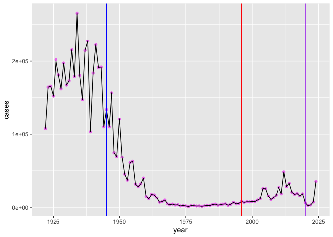
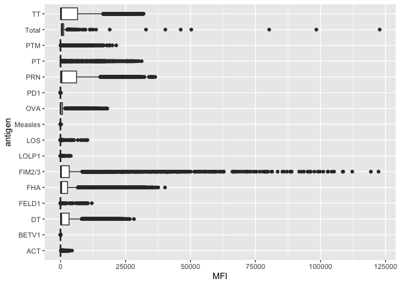
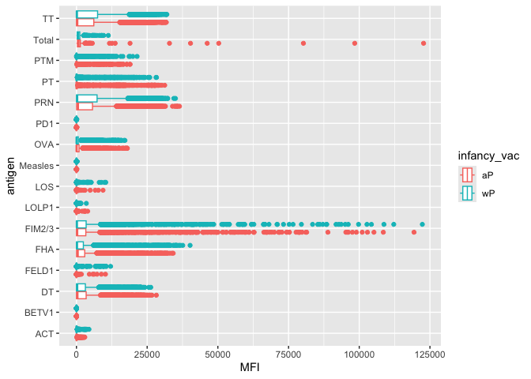
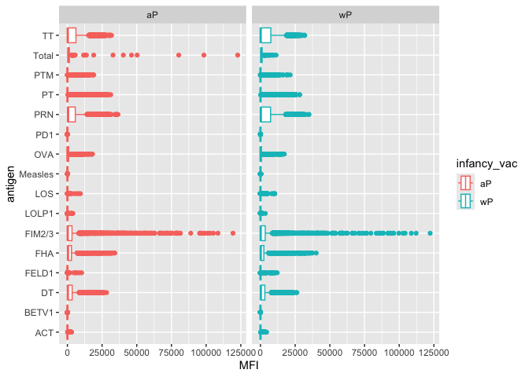
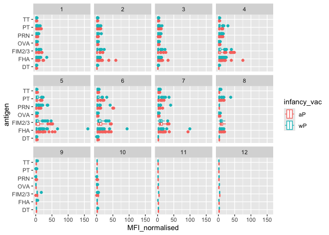

# class18
Kate Zhou (PID:A17373286)

- [Background](#background)
- [Examining cases of Pertussis by
  year](#examining-cases-of-pertussis-by-year)
- [Enter the CMI-PB project](#enter-the-cmi-pb-project)

## Background

Pertussis (a.k.a whooping cough) is a common lung infection caused by
the bacteria *B.Pertussis*.

The CDC tracks cases of Pertussis in the US:
https://www.cdc.gov/pertussis/php/surveillance/pertussis-cases-by-year.html

## Examining cases of Pertussis by year

We can use

``` r
head(cdc)
```

      year  cases
    1 1922 107473
    2 1923 164191
    3 1924 165418
    4 1925 152003
    5 1926 202210
    6 1927 181411

> Q1. Make a plot of pertussis cases peryear using ggplot

``` r
library(ggplot2)

cases <-  ggplot(cdc) +
          aes(year,cases) +
          geom_point(col = "violet") +
          geom_line() 

cases
```


> Q2. Add some key time points in our history of interaction with
> Pertussis. These includewP roll-out (the first vaccine) in 1945 and
> the switch to aP in 1996

We can use `geom_vline()` for this

``` r
cases + geom_vline(xintercept =1945, col="blue") +
       geom_vline(xintercept =1996, col="red") +
       geom_vline(xintercept = 2020, col="purple")
```



> Q3. Describe what happened after the introduction of the aP vaccine?
> Do you have a possible explanation for the observed trend?

Mounting ecidence suggests that the newer **aP** vaccine is less
effective over the long term than the older **wP** vaccine that it
replaced. In other, words, vaccine protection wanes more rappidly with
aP than with wP.

## Enter the CMI-PB project

CMI-PB (computational Models of Immunity - Pertussis boost) major goal
is to incestigate how the immune responds differently to with aP vs wP
vaccinated individuals and be able to predict this at an erarly stage.

CMI-PB makes all their collected data freely avavilable and they store
it in a database composed different tables.

We can use the **jsonlite** package to read this data

``` r
library(jsonlite)
subject <- read_json("https://www.cmi-pb.org/api/subject", simplifyVector = TRUE) 
head(subject, 3)
```

      subject_id infancy_vac biological_sex              ethnicity  race
    1          1          wP         Female Not Hispanic or Latino White
    2          2          wP         Female Not Hispanic or Latino White
    3          3          wP         Female                Unknown White
      year_of_birth date_of_boost      dataset
    1    1986-01-01    2016-09-12 2020_dataset
    2    1968-01-01    2019-01-28 2020_dataset
    3    1983-01-01    2016-10-10 2020_dataset

> Q. How many subjects (i.e. enrolled people) are there in this dataset?

``` r
nrow(subject)
```

    [1] 172

> Q. How many “aP” and “wP” subjects are there?

``` r
table(subject$infancy_vac)
```


    aP wP 
    87 85 

> Q. How many Male/Female are in the dataset?

``` r
table(subject$biological_sex)
```


    Female   Male 
       112     60 

> Q. How about gender and race number

``` r
table(subject$race,subject$biological_sex)
```

                                               
                                                Female Male
      American Indian/Alaska Native                  0    1
      Asian                                         32   12
      Black or African American                      2    3
      More Than One Race                            15    4
      Native Hawaiian or Other Pacific Islander      1    1
      Unknown or Not Reported                       14    7
      White                                         48   32

> Q. Age

> Q. Is this representative of the US population?

No, UCSD student population

Let’s read another database table from CMI-PB

``` r
specimen <- read_json("https://www.cmi-pb.org/api/v5_1/specimen", 
                      simplifyVector = TRUE)

ab_data <- read_json("https://www.cmi-pb.org/api/v5_1/plasma_ab_titer", 
                      simplifyVector = TRUE)
```

``` r
head(specimen)
```

      specimen_id subject_id actual_day_relative_to_boost
    1           1          1                           -3
    2           2          1                            1
    3           3          1                            3
    4           4          1                            7
    5           5          1                           11
    6           6          1                           32
      planned_day_relative_to_boost specimen_type visit
    1                             0         Blood     1
    2                             1         Blood     2
    3                             3         Blood     3
    4                             7         Blood     4
    5                            14         Blood     5
    6                            30         Blood     6

``` r
head(ab_data)
```

      specimen_id isotype is_antigen_specific antigen        MFI MFI_normalised
    1           1     IgE               FALSE   Total 1110.21154       2.493425
    2           1     IgE               FALSE   Total 2708.91616       2.493425
    3           1     IgG                TRUE      PT   68.56614       3.736992
    4           1     IgG                TRUE     PRN  332.12718       2.602350
    5           1     IgG                TRUE     FHA 1887.12263      34.050956
    6           1     IgE                TRUE     ACT    0.10000       1.000000
       unit lower_limit_of_detection
    1 UG/ML                 2.096133
    2 IU/ML                29.170000
    3 IU/ML                 0.530000
    4 IU/ML                 6.205949
    5 IU/ML                 4.679535
    6 IU/ML                 2.816431

We want to “join” these tables to get all our information together. For
this we will use the **dplyr** package and `inner_join()` function.

``` r
library(dplyr)
```


    Attaching package: 'dplyr'

    The following objects are masked from 'package:stats':

        filter, lag

    The following objects are masked from 'package:base':

        intersect, setdiff, setequal, union

``` r
meta <- inner_join(subject, specimen)
```

    Joining with `by = join_by(subject_id)`

``` r
head(meta)
```

      subject_id infancy_vac biological_sex              ethnicity  race
    1          1          wP         Female Not Hispanic or Latino White
    2          1          wP         Female Not Hispanic or Latino White
    3          1          wP         Female Not Hispanic or Latino White
    4          1          wP         Female Not Hispanic or Latino White
    5          1          wP         Female Not Hispanic or Latino White
    6          1          wP         Female Not Hispanic or Latino White
      year_of_birth date_of_boost      dataset specimen_id
    1    1986-01-01    2016-09-12 2020_dataset           1
    2    1986-01-01    2016-09-12 2020_dataset           2
    3    1986-01-01    2016-09-12 2020_dataset           3
    4    1986-01-01    2016-09-12 2020_dataset           4
    5    1986-01-01    2016-09-12 2020_dataset           5
    6    1986-01-01    2016-09-12 2020_dataset           6
      actual_day_relative_to_boost planned_day_relative_to_boost specimen_type
    1                           -3                             0         Blood
    2                            1                             1         Blood
    3                            3                             3         Blood
    4                            7                             7         Blood
    5                           11                            14         Blood
    6                           32                            30         Blood
      visit
    1     1
    2     2
    3     3
    4     4
    5     5
    6     6

One more “join”to get ab_data

``` r
abdata <- inner_join(meta, ab_data)
```

    Joining with `by = join_by(specimen_id)`

``` r
head(abdata)
```

      subject_id infancy_vac biological_sex              ethnicity  race
    1          1          wP         Female Not Hispanic or Latino White
    2          1          wP         Female Not Hispanic or Latino White
    3          1          wP         Female Not Hispanic or Latino White
    4          1          wP         Female Not Hispanic or Latino White
    5          1          wP         Female Not Hispanic or Latino White
    6          1          wP         Female Not Hispanic or Latino White
      year_of_birth date_of_boost      dataset specimen_id
    1    1986-01-01    2016-09-12 2020_dataset           1
    2    1986-01-01    2016-09-12 2020_dataset           1
    3    1986-01-01    2016-09-12 2020_dataset           1
    4    1986-01-01    2016-09-12 2020_dataset           1
    5    1986-01-01    2016-09-12 2020_dataset           1
    6    1986-01-01    2016-09-12 2020_dataset           1
      actual_day_relative_to_boost planned_day_relative_to_boost specimen_type
    1                           -3                             0         Blood
    2                           -3                             0         Blood
    3                           -3                             0         Blood
    4                           -3                             0         Blood
    5                           -3                             0         Blood
    6                           -3                             0         Blood
      visit isotype is_antigen_specific antigen        MFI MFI_normalised  unit
    1     1     IgE               FALSE   Total 1110.21154       2.493425 UG/ML
    2     1     IgE               FALSE   Total 2708.91616       2.493425 IU/ML
    3     1     IgG                TRUE      PT   68.56614       3.736992 IU/ML
    4     1     IgG                TRUE     PRN  332.12718       2.602350 IU/ML
    5     1     IgG                TRUE     FHA 1887.12263      34.050956 IU/ML
    6     1     IgE                TRUE     ACT    0.10000       1.000000 IU/ML
      lower_limit_of_detection
    1                 2.096133
    2                29.170000
    3                 0.530000
    4                 6.205949
    5                 4.679535
    6                 2.816431

``` r
dim(abdata)
```

    [1] 61956    20

> Q. How many Ab isotypes are there in the dataset?

``` r
table(abdata$isotype)
```


      IgE   IgG  IgG1  IgG2  IgG3  IgG4 
     6698  7265 11993 12000 12000 12000 

> Q. How many different antigens are measured in the dataset?

``` r
table(abdata$antigen)
```


        ACT   BETV1      DT   FELD1     FHA  FIM2/3   LOLP1     LOS Measles     OVA 
       1970    1970    6318    1970    6712    6318    1970    1970    1970    6318 
        PD1     PRN      PT     PTM   Total      TT 
       1970    6712    6712    1970     788    6318 

> Q. Make a boxplot of antigen levels accross the whole dataset

``` r
ggplot(abdata) +
  aes(MFI, antigen) +
  geom_boxplot()
```

    Warning: Removed 1 row containing non-finite outside the scale range
    (`stat_boxplot()`).



> Q. Are there obvious differenes between aP and wP values

``` r
ggplot(abdata) +
  aes(MFI, antigen, col=infancy_vac) +
  geom_boxplot()
```

    Warning: Removed 1 row containing non-finite outside the scale range
    (`stat_boxplot()`).



Or we can `infancy_vac` to get two individual plots one for each value
of `infancy_vac`

``` r
ggplot(abdata) +
  aes(MFI, antigen, col=infancy_vac) +
  geom_boxplot() +
  facet_wrap(~infancy_vac)
```

    Warning: Removed 1 row containing non-finite outside the scale range
    (`stat_boxplot()`).



viral infections.

``` r
igg <- abdata |> 
  filter(isotype == "IgG")

head(igg)
```

      subject_id infancy_vac biological_sex              ethnicity  race
    1          1          wP         Female Not Hispanic or Latino White
    2          1          wP         Female Not Hispanic or Latino White
    3          1          wP         Female Not Hispanic or Latino White
    4          1          wP         Female Not Hispanic or Latino White
    5          1          wP         Female Not Hispanic or Latino White
    6          1          wP         Female Not Hispanic or Latino White
      year_of_birth date_of_boost      dataset specimen_id
    1    1986-01-01    2016-09-12 2020_dataset           1
    2    1986-01-01    2016-09-12 2020_dataset           1
    3    1986-01-01    2016-09-12 2020_dataset           1
    4    1986-01-01    2016-09-12 2020_dataset           2
    5    1986-01-01    2016-09-12 2020_dataset           2
    6    1986-01-01    2016-09-12 2020_dataset           2
      actual_day_relative_to_boost planned_day_relative_to_boost specimen_type
    1                           -3                             0         Blood
    2                           -3                             0         Blood
    3                           -3                             0         Blood
    4                            1                             1         Blood
    5                            1                             1         Blood
    6                            1                             1         Blood
      visit isotype is_antigen_specific antigen        MFI MFI_normalised  unit
    1     1     IgG                TRUE      PT   68.56614       3.736992 IU/ML
    2     1     IgG                TRUE     PRN  332.12718       2.602350 IU/ML
    3     1     IgG                TRUE     FHA 1887.12263      34.050956 IU/ML
    4     2     IgG                TRUE      PT   41.38442       2.255534 IU/ML
    5     2     IgG                TRUE     PRN  174.89761       1.370393 IU/ML
    6     2     IgG                TRUE     FHA  246.00957       4.438960 IU/ML
      lower_limit_of_detection
    1                 0.530000
    2                 6.205949
    3                 4.679535
    4                 0.530000
    5                 6.205949
    6                 4.679535

``` r
ggplot(igg) +
  aes(MFI_normalised, antigen, col=infancy_vac) +
  geom_boxplot() +
  facet_wrap(~visit)
```



Focus in furthwer in jsut one of these anitgens - let’s pick **PT**
(Pertussis Toxin, one of the main toxins of the bacteria)

``` r
table(igg$dataset)
```


    2020_dataset 2021_dataset 2022_dataset 2023_dataset 
            1182         1617         1456         3010 

``` r
pt_igg <- abdata |>
          filter(isotype == "IgG",
                 antigen == "PT",
                 dataset == "2021_dataset")

head(pt_igg)
```

      subject_id infancy_vac biological_sex              ethnicity
    1         61          wP         Female Not Hispanic or Latino
    2         61          wP         Female Not Hispanic or Latino
    3         61          wP         Female Not Hispanic or Latino
    4         61          wP         Female Not Hispanic or Latino
    5         61          wP         Female Not Hispanic or Latino
    6         61          wP         Female Not Hispanic or Latino
                         race year_of_birth date_of_boost      dataset specimen_id
    1 Unknown or Not Reported    1987-01-01    2019-04-08 2021_dataset         468
    2 Unknown or Not Reported    1987-01-01    2019-04-08 2021_dataset         469
    3 Unknown or Not Reported    1987-01-01    2019-04-08 2021_dataset         470
    4 Unknown or Not Reported    1987-01-01    2019-04-08 2021_dataset         471
    5 Unknown or Not Reported    1987-01-01    2019-04-08 2021_dataset         472
    6 Unknown or Not Reported    1987-01-01    2019-04-08 2021_dataset         473
      actual_day_relative_to_boost planned_day_relative_to_boost specimen_type
    1                           -4                             0         Blood
    2                            1                             1         Blood
    3                            3                             3         Blood
    4                            7                             7         Blood
    5                           14                            14         Blood
    6                           30                            30         Blood
      visit isotype is_antigen_specific antigen    MFI MFI_normalised unit
    1     1     IgG               FALSE      PT 112.75      1.0000000  MFI
    2     2     IgG               FALSE      PT 111.25      0.9866962  MFI
    3     3     IgG               FALSE      PT 125.50      1.1130820  MFI
    4     4     IgG               FALSE      PT 224.25      1.9889135  MFI
    5     5     IgG               FALSE      PT 304.00      2.6962306  MFI
    6     6     IgG               FALSE      PT 274.00      2.4301552  MFI
      lower_limit_of_detection
    1                 5.197441
    2                 5.197441
    3                 5.197441
    4                 5.197441
    5                 5.197441
    6                 5.197441

``` r
dim(pt_igg)
```

    [1] 231  20

``` r
ggplot(pt_igg) +
  aes(actual_day_relative_to_boost, MFI_normalised, 
      col = infancy_vac,
      # connect lines with the same subject_id
      group=subject_id) +
  geom_point() +
  geom_line() +
  theme_bw() +
  geom_vline(xintercept = 0) +
  geom_vline(xintercept = 14)
```


